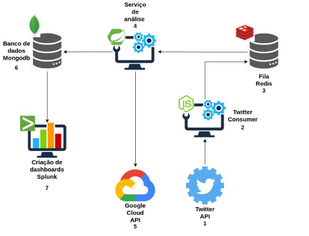

# twitter-consumer

*Descrição:* Sistema desenvolvido como parte de um trabalho de conclusão de curso de Engenharia de Software. 

Aluno: Igor Costa de Oliveira Obeica

Orientador: Daves Marcio Silva Martins

Centro Universitário Academia - Uniacademia / Juiz de Fora

Este serviço tem o objetivo de coletar comentários no Twitter contendo um termo de busca fornecido pelo usuário 
e enviá-los para uma fila no Redis para que possam ser consumidos por outras aplicações que irão realizar a análise de sentimentos.

---
### Pré-requisitos:
- Node 10+
- Npm 6+

---

### Fluxo dos sistemas:
Esse serviço deve ser executado em conjunto com o [*serviço de análise de sentimentos*](https://github.com/IgorCooli/twitter-analysis-service).

---

### Endpoints:
`URL_SISTEMA/run` -> Começa o processo de coleta dos dados

---

### Variáveis de ambiente

| Chave  | Valor |
| ------------- | ------------- |
| ACCESS_TOKEN  | {Token Twitter API}  |
| ACCESS_TOKEN_SECRET  | {Token Secret Twitter API}  |
| CONSUMER_KEY  | {Consumer Key Twitter API}  |
| CONSUMER_SECRET  | {Consumer Secret Twitter API}  |
| REDIS_BASE_URL  | {Redis URL}  |
| REDIS_PASS  | {Redis Password}  |
| REDIS_PORT  | {Redis Port}  |
| SEARCH_STRING  | {Search String}  |
| TIMER  | {Search Time}  |

---

#### Desenvolvido por:
- Igor Oliveira [*#Github*](https://github.com/IgorCooli) [*#Linkedin*](https://www.linkedin.com/in/igor-obeica/)
